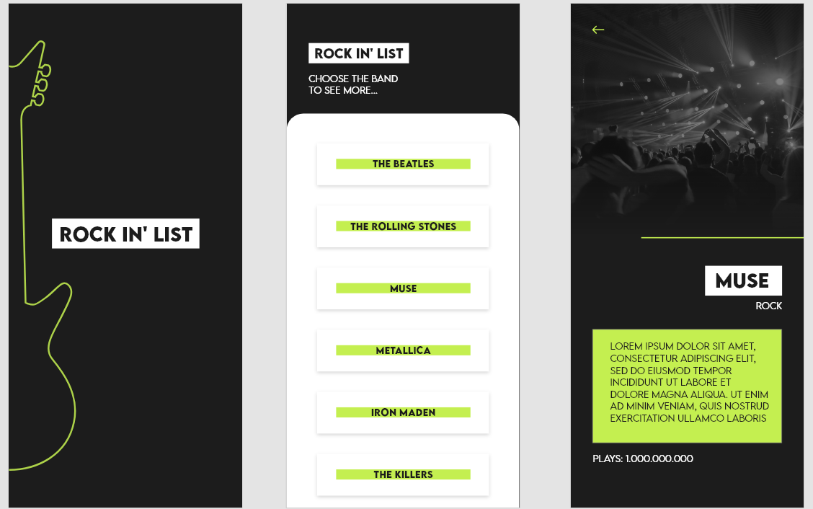

# RockInList

### O RockInList é um aplicativo que lista bandas

### Tecnologias
- [Expo](https://expo.io/)
- [React Native](https://reactnative.dev/)
- [TypeScript](https://www.typescriptlang.org/)
 
### Instalando
```terminal
# Clone este repositório
$ git clone <https://github.com/YukihiroYamashita/RockInList.git>

# Vá para a pasta do projeto e instale os repositórios
$ yarn

# Após instalar as dependências, inicie o projeto
$ expo start
```

### Features
- [x] Lista de bandas
- [x] Offline First


### Telas
<h1 align="center">
  
</h1>
